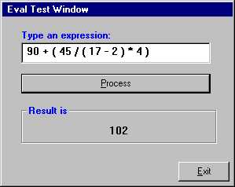



## A Eval function \- evaluates math expressions

### Description

EVal evaluates math expressions like 2 + 3 / ( 99.5 - 10 ). Whole code is in a .bas file and there is a test application (see Screenshot). Operations availables are +, -, /, * and to make powers (^) usage character e (Ex: 2e4 = 16).
 
### More Info
 

             |
---                |---
**Submitted On**   |2001-02-23 23:25:14
**By**             |[Ciro Sisman Pereira](https://github.com/Planet-Source-Code/PSCIndex/blob/master/ByAuthor/ciro-sisman-pereira.md)
**Level**          |Advanced
**User Rating**    |4.6 (65 globes from 14 users)
**Compatibility**  |VB 3\.0, VB 4\.0 \(16\-bit\), VB 5\.0, VB 6\.0
**Category**       |[Math/ Dates](https://github.com/Planet-Source-Code/PSCIndex/blob/master/ByCategory/math-dates__1-37.md)
**World**          |[Visual Basic](https://github.com/Planet-Source-Code/PSCIndex/blob/master/ByWorld/visual-basic.md)
**Archive File**   |[CODE\_UPLOAD154062232001\.zip](https://github.com/Planet-Source-Code/ciro-sisman-pereira-a-eval-function-evaluates-math-expressions__1-21277/archive/master.zip)

